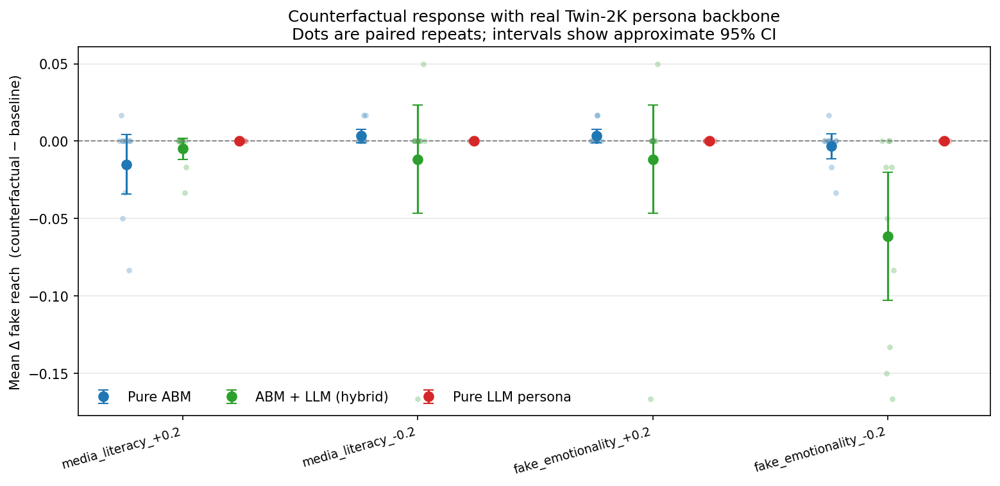
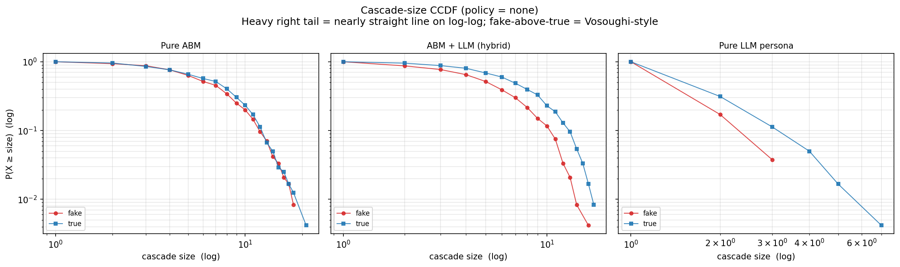
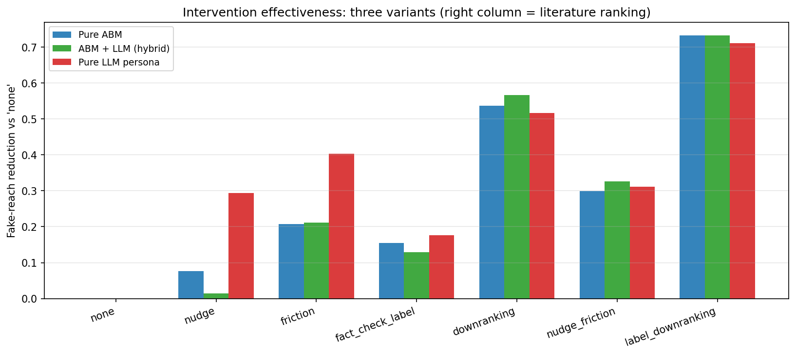

# The Fake-News Simulator That Could Not Imagine a Counterfactual
*By Claire Yuqing Yang*

Misinformation research has a strange problem: the better our language models get at sounding human, the easier it becomes to confuse *plausible narration* with *social explanation*. I built a small fake-news diffusion simulator to test that temptation. The question was not whether an LLM could describe why someone might share a rumor. The question was whether generative AI could help an agent-based model behave more like real misinformation cascades while still answering the policy question we actually care about: what would change if people, platforms, or stories were different?

The experiment compares three versions of the same social network. In the first, `pure_abm`, agents follow hand-written behavioral rules. In the second, `abm_llm`, the same agents also receive OpenAI-generated perception scores: how important, emotional, and personally relevant each story feels to each persona. In the third, `pure_llm`, the model lets the LLM directly assign each persona a belief probability, sharing propensity, belief lability, and resistance to corrections. Those LLM calls are cached in `data/`, so the analysis uses actual generative-AI outputs rather than keywords or a hand-coded sentiment score.

  
*Figure 1. Counterfactual response in fake-news reach. The hybrid ABM+LLM model moves when media literacy or story emotionality changes; the pure LLM-persona model is flat because its cached behavior profiles do not update when traits are perturbed.*

The first surprise is that the most "AI-like" model is the least useful for policy. When I increased or decreased media literacy and fake-story emotionality, `pure_llm` produced exactly zero change in fake-news reach across all four counterfactuals. That is not because the LLM gave cautious answers. It is because the model cached one behavioral profile per persona-story pair, so later changes to media literacy or story emotionality never entered the decision process. In contrast, the hybrid model had nonzero, directionally sensible movement: lower media literacy increased fake reach, and lower emotionality reduced it. Two of four hybrid counterfactuals reached p < 0.05, compared with one for the purely rule-based ABM.

This matters because a policy simulator that cannot answer "what if?" is not a simulator. It is an expensive snapshot. Generative AI is valuable here only when it is embedded inside a causal structure that can still be manipulated.

  
*Figure 2. Cascade-size CCDFs under no intervention. The hybrid model produces the fattest fake-news right tail, with a maximum fake cascade of 74 agents and a lower Hill tail exponent than the rule-only baseline.*

The second surprise is that the hybrid model also recovers the texture of misinformation better. Vosoughi, Roy, and Aral's famous Twitter study found that false news travels in unusually deep and broad cascades. My closed population of 200 agents cannot reproduce Twitter-scale explosions, but it can still reveal which model produces a heavier right tail. The answer is the hybrid. Its fake-news Hill tail exponent is 4.53, much lower than the rule-only model's 8.05 and the pure LLM model's 8.52. Lower means heavier-tailed: more rare, outsized cascades. The pure LLM model even points the wrong way, giving true news a heavier tail than fake news.

  
*Figure 3. Intervention effects on fake-news reach. Downranking and label-plus-downranking are the strongest interventions, while light-touch nudges are weakest, matching the broad literature ranking.*

The intervention ranking is the sanity check. If the model said nudges beat downranking, I would not trust the rest. Instead, both the rule-only and hybrid versions match the literature ordering exactly: label-plus-downranking and downranking work best, friction sits in the middle, and nudges are modest. The pure LLM version is close but swaps a few middle policies.

So the lesson is not "let the LLM drive." It is almost the opposite. Generative AI works best here as a perception layer: it translates personas and stories into psychologically richer inputs, while the ABM keeps the machinery of exposure, intervention, and counterfactual change explicit. That combination is less glamorous than a fully autonomous LLM society, but more scientifically useful.

The larger implication is uncomfortable for AI social science. Human-sounding agents are not automatically better agents. If their outputs are cached, static, or detached from manipulable mechanisms, they may make our simulations feel deeper while making them less answerable. The strongest model in this project is not the one with the most AI. It is the one that gives AI a smaller, disciplined job.

Source data: [OpenAI hybrid perception cache](data/hybrid_perception.csv), [OpenAI persona decision cache](data/llm_persona_decisions.csv), [counterfactual results](outputs/cf_stability_pvalues.csv), [cascade tail summary](outputs/heavytail_tail_summary.csv), [intervention ranking results](outputs/compare_ranking_alignment.csv), [Vosoughi, Roy & Aral 2018](https://www.science.org/doi/10.1126/science.aap9559)
