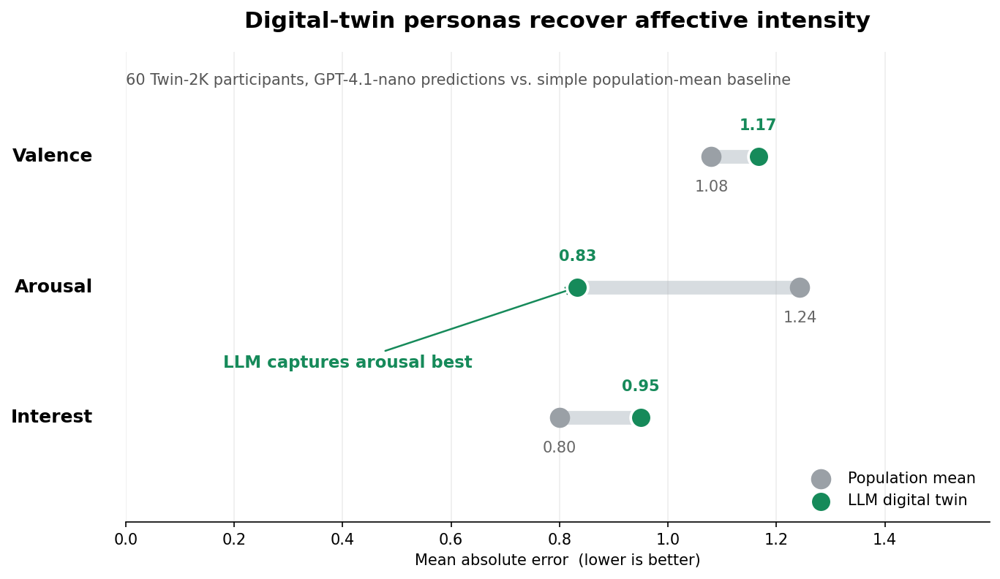

# The Fake-News Simulator That Learned to Ask Who Was Reading
*By Claire Yuqing Yang*

Most misinformation models treat "the public" like a single blur. But fake news does not spread through a blur. It spreads through people: impatient readers, partisan readers, anxious readers, skeptical readers, curious readers. My final project asks whether generative AI can help a simulation remember that fact without turning social science into black-box role-play.

I started with an agent-based model of fake-news diffusion, then upgraded its personas using the public Twin-2K digital-twin dataset: 2,058 real survey participants with rich demographic, personality, cognitive, economic, and behavioral measures. Instead of inventing generic agents from scratch, I used these real participant summaries as the backbone for LLM-based personas. The goal was not merely to say "AI can simulate people." The goal was to test where AI belongs in a policy simulation.

The first step was validation. I used the `story_beliefs` split, where real participants read story chapters and rated the chapter's valence, arousal, and their interest in continuing. For 60 participants, I gave `gpt-4.1-nano` each person's persona summary plus the same chapter and asked it to predict that person's survey answers. This is a small validation slice, but it creates an important bridge: before using digital twins to simulate misinformation, we can ask whether they predict any real human response at all.

  
*Figure 1. Digital-twin validation on 60 real Twin-2K participants. The LLM twin beats the population mean baseline on arousal prediction (MAE 0.83 vs. 1.24), but not on valence or interest, a useful warning that digital twins are promising but uneven.*

The result is encouraging and humbling. The LLM digital twin predicted arousal substantially better than a population-average baseline, and 83% of arousal predictions landed within one point of the human answer. But it did not beat the baseline on valence or interest. That matters. The dataset improves the project because it gives us real individual-level ground truth; it does not magically make LLM personas omniscient. A good digital twin simulation should begin with this kind of validation scar tissue.

After that check, I returned to the misinformation simulator using those same real-persona summaries as the agent backbone. I compared three designs. `pure_abm` uses hand-written behavioral rules over traits derived from the survey summaries. `pure_llm` asks the LLM for a full behavior profile: belief probability, sharing propensity, belief lability, and correction resistance. `abm_llm` uses the LLM more narrowly, as a perception layer: how important, emotional, and personally relevant a story feels to a real participant-persona. The ABM still handles exposure, interventions, and counterfactual changes.

  
*Figure 2. Mean paired counterfactual response in fake-news reach using 60 real Twin-2K personas as the agent backbone. Dots show repeated runs; the pure LLM-persona model is flat because its cached behavior profiles do not update when traits are perturbed.*

The counterfactual result is the project's sharpest lesson. The most "AI-like" model, `pure_llm`, is the least useful for policy. It has data; the API ran. But because its behavior profiles are cached by persona-story pair, changing media literacy or fake-story emotionality does not change the cached profile. Baseline and counterfactual runs become identical. The model sounds human, but it cannot answer "what if?" without re-querying the LLM and mixing the intervention with prompt noise.

The hybrid model avoids that trap. It lets generative AI enrich the human side of the model while keeping the causal machinery explicit. If media literacy changes, the ABM responds. If the story itself changes, the LLM perception layer can be updated. The division of labor is the point.

  
*Figure 3. Cascade-size CCDFs under no intervention, again using the Twin-2K persona backbone. None of the three models reproduces the classic Vosoughi pattern in which fake-news cascades are clearly larger than true-news cascades.*

The heavy-tail test is the useful negative result. Vosoughi, Roy, and Aral found that falsehoods on Twitter traveled farther, faster, and in more extreme cascades than truth. My 60-person closed simulation cannot reproduce Twitter scale, but it can ask whether any model points in the right direction. Under the real digital-twin backbone, none does. In the no-intervention runs, true-news cascades are at least as large as fake-news cascades across the main variants; the hybrid model's mean fake cascade is 5.13 agents, versus 6.89 for true news. That failure matters because it prevents the project from overclaiming. Digital twins make the agents more grounded, not automatically more historically accurate.

So the final takeaway is not that digital twins solve misinformation modeling. It is more disciplined: real digital-twin personas give LLM simulation a better empirical foundation, but they still need validation against outcomes. The best model is not the one with the most AI. The best model gives AI the right job: predict human perception where it has evidence, and leave counterfactual policy logic inside a transparent social mechanism.

Source data: [Twin-2K-500 public dataset](https://huggingface.co/datasets/LLM-Digital-Twin/Twin-2K-500), [Twin-2K-500 Mega Study](https://huggingface.co/datasets/LLM-Digital-Twin/Twin-2K-500-Mega-Study), [digital twin validation metrics](data/digital_twin_validation_metrics.csv), [OpenAI persona predictions](data/digital_twin_story_predictions.csv), [counterfactual summary](outputs/cf_stability_summary.csv), [cascade tail summary](outputs/heavytail_tail_summary.csv), [Vosoughi, Roy & Aral 2018](https://www.science.org/doi/10.1126/science.aap9559)
